# Introduction

## Background and Motivation

Gas turbine engines convert high-temperature, high-pressure combustion gases into mechanical energy for aircraft propulsion and power generation. The turbine blades within these engines operate under extreme conditions: inlet temperatures can exceed 1,500°C, well above the melting point of most metal alloys. This creates severe thermal and mechanical loads that induce stress and deformation in the blades. Prolonged exposure accelerates engine degradation, making turbine blade design a critical engineering challenge.

Physical prototyping is expensive and time-consuming, so we use a finite-element model (FEM) computer simulator that predicts the von Mises stress distribution and displacement across the blade surface. The simulator accepts six input variables (@tbl-inputs) and returns two scalar outputs: maximum stress and maximum displacement.

| Variable | Description | Range | Type |
|:----|:---------|:----------|:--------|
| $x_1$ | Young's Modulus | $[2 \times 10^{11},\; 3 \times 10^{11}]$ Pa | Material |
| $x_2$ | Poisson's Ratio | $[0.1,\; 0.49]$ | Material |
| $x_3$ | CTE | $[5 \times 10^{-6},\; 1.5 \times 10^{-5}]$ K$^{-1}$ | Material |
| $x_4$ | Thermal Conductivity | $[5,\; 15]$ W/m/K | Material |
| $x_5$ | Cooling Air Temperature | $[50,\; 350]$ °C | Operational ($\pm 2$°C) |
| $x_6$ | Pressure Load | $[10^5,\; 4.8 \times 10^5]$ Pa | Operational ($\pm 10^4$ Pa) |

: Input variables for the FEM turbine blade simulator. {#tbl-inputs}

## Problem Formulation

Let $\mathbf{x}_d = (x_1, x_2, x_3, x_4)$ denote the material parameters that can be precisely controlled, and let $x_5^*, x_6^*$ denote the nominal operational set-points. The operational inputs are subject to uncontrollable perturbations:

$$
\begin{aligned}
x_{5,\text{actual}} &= x_5^* + \varepsilon_5, \quad \varepsilon_5 \sim \text{Uniform}(-2,\; +2) \\
x_{6,\text{actual}} &= x_6^* + \varepsilon_6, \quad \varepsilon_6 \sim \text{Uniform}(-10^4,\; +10^4)
\end{aligned}
$$

The constrained robust optimization problem is:

$$
\begin{aligned}
\min_{\mathbf{x}_d,\, x_5^*,\, x_6^*} &\quad \mathbb{E}_{\varepsilon}\!\left[\text{stress}(\mathbf{x}_d,\; x_5^* + \varepsilon_5,\; x_6^* + \varepsilon_6)\right] \\
\text{s.t.} &\quad \Pr_{\varepsilon}\!\left[\text{displacement}(\mathbf{x}_d,\; x_5^* + \varepsilon_5,\; x_6^* + \varepsilon_6) < d^*\right] \geq 1 - \alpha
\end{aligned}
$$

where $d^* = 1.3 \times 10^{-3}$ m is the displacement failure threshold. The computational budget is limited to 300 simulator evaluations, each taking approximately 80 seconds.

# Methodology

## Phase 1: Initial Space-Filling Design (100 runs)

We generated a 100-point maximin Latin Hypercube Design (LHD) in the six-dimensional unit hypercube $[0,1]^6$, where each input is scaled via $z_i = (x_i - L_i)/(U_i - L_i)$. The LHD ensures that each input's marginal distribution is uniform: the $[0,1]$ interval is partitioned into $n = 100$ equal strata with exactly one point per stratum. The maximin criterion further optimizes the arrangement by maximizing the minimum pairwise Euclidean distance among all points. We selected the best LHD from 50 random candidates, achieving a minimum pairwise distance of 0.261. With 100 points in 6 dimensions (~17 per variable), this design provides ample data for fitting a smooth surrogate model.

## Phase 2: Gaussian Process Surrogate Model

We fit independent Gaussian Process (GP) models for stress and displacement. A GP defines a distribution over functions: given observed data, it provides a posterior mean $\mu(\mathbf{z})$ (best prediction) and posterior variance $\sigma^2(\mathbf{z})$ (uncertainty) at any untested point:

$$
y(\mathbf{z}) \sim \mathcal{GP}\!\left(\mu,\; k(\mathbf{z}, \mathbf{z}')\right)
$$

where $\mu$ is a constant mean and $k(\mathbf{z}, \mathbf{z}')$ is the covariance kernel. We use the Matérn-5/2 kernel with Automatic Relevance Determination (ARD):

$$
k(\mathbf{z}, \mathbf{z}') = \sigma^2 \left(1 + \sqrt{5}\,r + \tfrac{5r^2}{3}\right) \exp(-\sqrt{5}\,r), \quad r = \sqrt{\sum_{j=1}^{6} \frac{(z_j - z_j')^2}{\theta_j^2}}
$$

A short length-scale $\theta_j$ means the output changes rapidly with input $j$ (high sensitivity); a long $\theta_j$ indicates little effect. This provides a built-in variable importance measure. A nugget term ($\sigma_n^2 \sim 10^{-6}$) is added for numerical stability. Since the simulator is deterministic, the GP interpolates exactly through observed data.

All hyperparameters — $\sigma^2$, $\theta_1, \ldots, \theta_6$, $\sigma_n^2$ — are estimated by maximizing the log marginal likelihood:

$$
\log p(\mathbf{y} \mid \mathbf{Z}) = -\frac{1}{2}\mathbf{y}^\top \mathbf{K}^{-1}\mathbf{y} - \frac{1}{2}\log|\mathbf{K}| - \frac{n}{2}\log(2\pi)
$$

where $\mathbf{K}$ is the $n \times n$ covariance matrix with $K_{ij} = k(\mathbf{z}_i, \mathbf{z}_j) + \sigma_n^2 \delta_{ij}$. Model accuracy is assessed via 10-fold cross-validation with hyperparameters re-estimated in each fold. @tbl-cv summarizes the CV metrics; both surrogates achieve $R^2 > 0.99$. @fig-cv plots predicted versus actual values — the tight clustering around the 45° line confirms excellent predictive accuracy. @fig-qq shows QQ plots of standardized residuals; the close agreement with the theoretical diagonal indicates that the GP uncertainty estimates are well-calibrated, with empirical 95%-coverage near the nominal level.

| Response | CV $R^2$ | RMSE | MAPE | 95% Coverage |
|:---------|:---------|:-----|:-----|:-------------|
| Stress | 0.9956 | $1.82 \times 10^7$ | 1.33% | 92% |
| Displacement | 0.9942 | $2.79 \times 10^{-5}$ | 1.06% | 91% |

: 10-fold cross-validation results for the GP surrogates. {#tbl-cv}

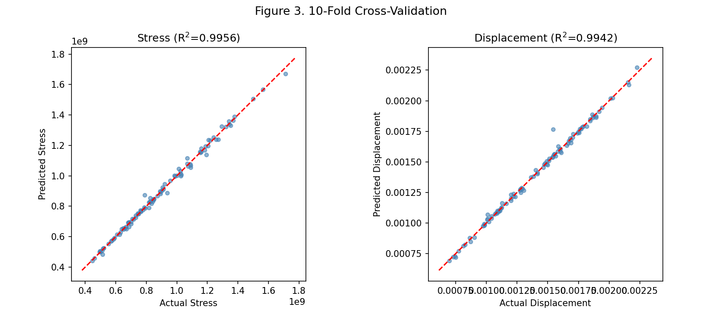{#fig-cv width=80%}

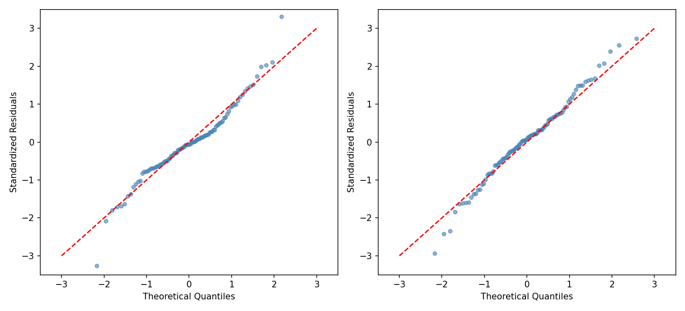{#fig-qq width=80%}

## Phase 3: Sequential Constrained Optimization (150 runs)

We sequentially select new evaluation points by maximizing the Expected Improvement with Constraints (EIC):

$$
\text{EIC}(\mathbf{z}) = \text{EI}(\mathbf{z}) \cdot \Pr[\text{displacement}(\mathbf{z}) < d^*]
$$

The Expected Improvement for stress minimization is:

$$
\text{EI}(\mathbf{z}) = (f^* - \mu_s(\mathbf{z}))\,\Phi(u) + \sigma_s(\mathbf{z})\,\phi(u), \quad u = \frac{f^* - \mu_s(\mathbf{z})}{\sigma_s(\mathbf{z})}
$$

where $f^*$ is the best feasible stress found so far, $\mu_s$ and $\sigma_s$ are the GP posterior mean and standard deviation, and $\Phi$, $\phi$ are the standard normal CDF and PDF. The constraint probability is:

$$
\Pr[\text{disp}(\mathbf{z}) < d^*] = \Phi\!\left(\frac{d^* - \mu_d(\mathbf{z})}{\sigma_d(\mathbf{z})}\right)
$$

We generate batches of 15–20 points per iteration with a diversified strategy (EIC on 80,000 random candidates with minimum-distance penalty). Over 150 sequential runs, the best feasible stress improved from $4.46 \times 10^8$ to $2.64 \times 10^8$ Pa.

## Phase 4: Robust Validation (27 runs)

We select 3 diverse top candidates and evaluate each on a $3 \times 3$ factorial grid of operational perturbations:

$$
x_5 \in \{x_5^* - 2,\; x_5^*,\; x_5^* + 2\}, \quad x_6 \in \{x_6^* - 10^4,\; x_6^*,\; x_6^* + 10^4\}
$$

This yields 9 runs per candidate (27 total), covering the extreme corners of the operational tolerance region.

## Phase 5: Final Validation (23 runs)

The remaining 23 runs provide final verification: all 23 are random $(x_5, x_6)$ perturbations sampled via a 2D LHD to confirm local optimality.

# Results

## Exploratory Analysis

The initial 100 simulations reveal that stress spans a nearly $4\times$ range $[4.46 \times 10^8,\; 1.71 \times 10^9]$ Pa, and only 43% of designs satisfy the displacement constraint. Stress and displacement are strongly positively correlated ($r = 0.80$), meaning that optimizing for low stress naturally helps satisfy the displacement constraint. @fig-dist shows the marginal distributions of both responses; the displacement histogram highlights that more than half of the initial designs exceed the feasibility threshold $d^*$. Per-variable scatter plots are provided in @fig-scatter (Appendix B), where infeasible designs (red) cluster visibly at high CTE values.

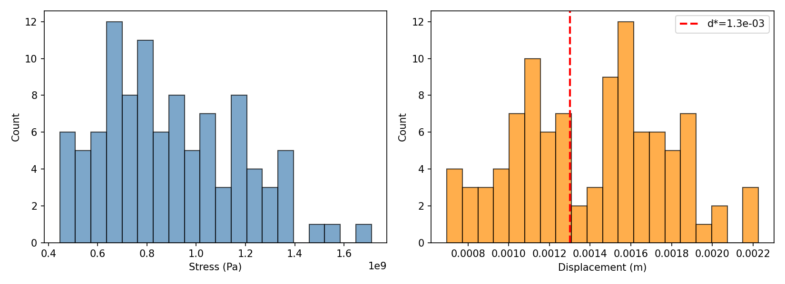{#fig-dist width=75%}

## Sensitivity Analysis

The ARD length-scale parameters $\theta_j$ provide an interpretable variable importance measure. Shorter $\theta_j$ means the GP output changes more rapidly with input $j$. Relative importance is $(1/\theta_j) / \sum_k (1/\theta_k)$.

| Variable | Stress $\theta$ | Stress Imp. | Displ. $\theta$ | Displ. Imp. |
|:---------|:----------------|:------------|:----------------|:------------|
| $x_1$ (Young's Mod.) | 5.38 | 0.177 | 10.00 | 0.070 |
| $x_2$ (Poisson's) | 5.57 | 0.171 | 1.60 | 0.440 |
| $x_3$ (CTE) | **3.16** | **0.301** | 5.05 | 0.139 |
| $x_4$ (Therm. Cond.) | 10.00 | 0.095 | 6.74 | 0.104 |
| $x_5$ (Cooling) | 6.63 | 0.143 | 10.00 | 0.070 |
| $x_6$ (Pressure) | 8.38 | 0.114 | 3.97 | 0.177 |

: ARD length-scale analysis. For stress, $x_3$ (CTE) has the shortest $\theta$ and highest importance. {#tbl-sensitivity}

For stress, $x_3$ (CTE) has the shortest length-scale ($\theta_3 = 3.16$), making it the most influential variable (30.1%), followed by $x_1$ (17.7%) and $x_2$ (17.1%). Raw Pearson correlations confirm: $|r(x_3, \text{stress})| = 0.87$, far exceeding all others ($< 0.39$). For displacement, $x_2$ shows a short length-scale (1.60) due to local nonlinearity, but the dominant global driver remains $x_3$ ($|r| = 0.90$). These rankings are detailed in @tbl-sensitivity and visualized as bar charts in @fig-sensitivity. @fig-main displays the main-effect profiles: as each input sweeps from its lower to upper bound (with all other inputs held at center), the steep decline of stress with decreasing $x_3$ is evident, while the displacement constraint (red dashed line) is most sensitive to $x_6$ (pressure load).

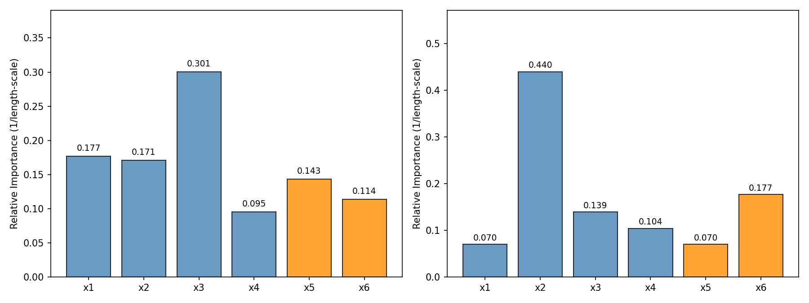{#fig-sensitivity width=75%}

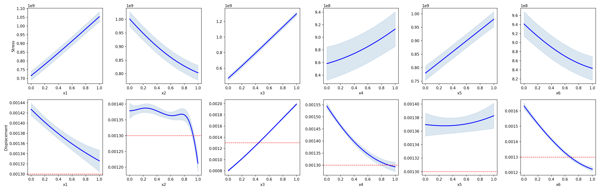{#fig-main width=85%}

## Optimization Convergence

| Stage | Cumul. Runs | Best Stress | Improvement |
|:------|:------------|:------------|:------------|
| Initial LHD | 100 | $4.461 \times 10^8$ | — |
| + Batch 1 (+20) | 120 | $2.868 \times 10^8$ | 35.7% |
| + Batch 2 (+20) | 140 | $2.736 \times 10^8$ | 38.7% |
| + Batches 3–8 (+110) | 250 | $2.636 \times 10^8$ | 40.9% |

: Sequential optimization convergence. {#tbl-convergence}

The first 20 sequential runs achieved the largest improvement (35.7%), as the GP rapidly identified the low-CTE corner. Subsequent batches refined with diminishing returns, indicating convergence. @tbl-convergence summarizes the cumulative improvement at each stage, and @fig-conv visualizes the full trajectory: the green best-feasible curve in panel (a) drops steeply during the first batch and flattens thereafter, while panel (b) shows that nearly all sequential points remain well below the displacement threshold $d^*$.

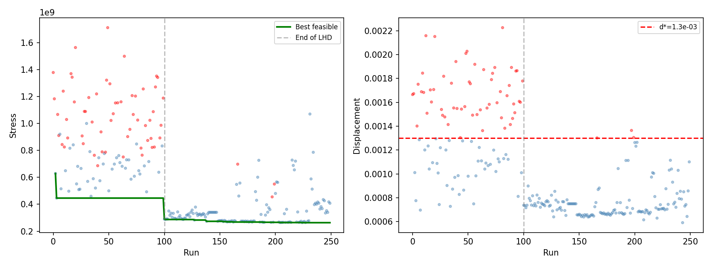{#fig-conv width=80%}

## Recommended Design

| Parameter | Optimal Value | Unit | Note |
|:----------|:--------------|:-----|:-----|
| $x_1$: Young's Modulus | $2.000 \times 10^{11}$ | Pa | Lower bound |
| $x_2$: Poisson's Ratio | 0.477 | — | Near upper bound |
| $x_3$: CTE | $5.000 \times 10^{-6}$ | K$^{-1}$ | **Lower bound** |
| $x_4$: Thermal Conductivity | 5.0 | W/m/K | Lower bound |
| $x_5$: Cooling Temperature | 50.0 | °C | Lower bound |
| $x_6$: Pressure Load | $4.049 \times 10^5$ | Pa | Mid-upper range |

: Recommended blade design specification. {#tbl-design}

The optimizer pushes CTE to its minimum, consistent with the sensitivity analysis. Young's Modulus is at its lower bound (softer material absorbs deformation without high stress), and cooling temperature is at the minimum (maximum cooling). The Poisson's Ratio is near its upper bound (0.477), allowing lateral expansion that relieves stress concentrations. Three variables at their bounds suggests expanding the design ranges could yield further improvements. @tbl-design lists the full optimal specification, and @fig-blade shows the simulated von Mises stress field — the predominantly blue coloring confirms uniformly low stress across the blade surface.

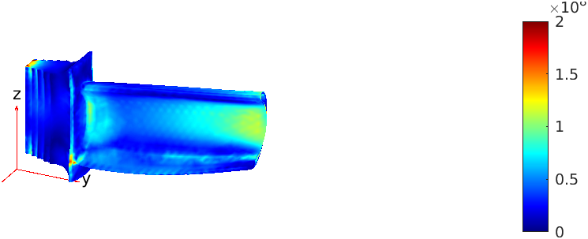{#fig-blade width=60%}

## Robustness Under Operational Uncertainty

The $3 \times 3$ factorial grid tests each candidate at 9 extreme combinations of operational perturbations:

| Candidate | $\mathbb{E}[\text{stress}]$ | $\text{Std}[\text{stress}]$ | CV | Max disp. | Feasible? |
|:----------|:--------------------------|:---------------------------|:---|:----------|:----------|
| **C1 (best)** | $2.650 \times 10^8$ | $9.47 \times 10^5$ | 0.36% | $7.10 \times 10^{-4}$ | 9/9 (100%) |
| C2 | $2.697 \times 10^8$ | $1.32 \times 10^6$ | 0.49% | $6.57 \times 10^{-4}$ | 9/9 (100%) |
| C3 | $2.685 \times 10^8$ | $1.80 \times 10^6$ | 0.67% | $6.75 \times 10^{-4}$ | 9/9 (100%) |

: Robustness comparison across 3 diverse candidates. {#tbl-robust}

All three candidates achieve 100% feasibility, as shown in @tbl-robust. Candidate 1 has the lowest mean stress and smallest variability (CV = 0.36%). @fig-robust displays the corresponding boxplots: the stress distributions (panel a) are tightly concentrated for all three candidates, and every displacement observation (panel b) falls well below $d^*$.

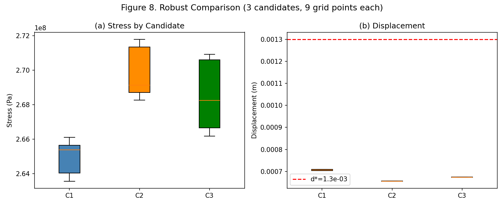{#fig-robust width=70%}

## Final Validation

| Metric | Value |
|:-------|:------|
| $\mathbb{E}[\text{stress}]$ (20 runs) | $2.644 \times 10^8$ Pa |
| Std[stress] | $7.04 \times 10^5$ Pa |
| CV[stress] | 0.27% |
| Max displacement | $7.10 \times 10^{-4}$ m |
| $\Pr(\text{feasible})$ | 20/20 = 100% |
| Safety margin vs $d^*$ | 45.4% |
| Material nearby (3 runs) | All $> 2.78 \times 10^8$ Pa |

: Final validation results for the recommended design. {#tbl-validation}

All 20 perturbation runs satisfy the constraint, with worst-case displacement 45% below $d^*$ (@tbl-validation). The 3 material perturbation runs all produce higher stress, confirming a local optimum. @fig-valid presents histograms of the validation results: stress (panel a) clusters tightly around the mean with a CV of only 0.27%, and all displacement values (panel b) remain far below the $d^*$ threshold.

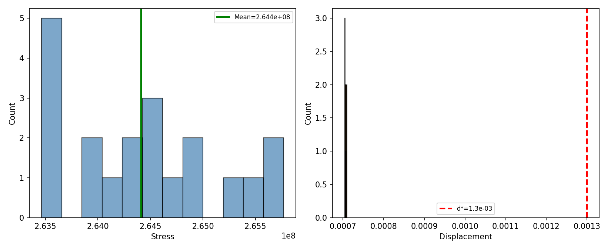{#fig-valid width=70%}

# Discussion

## Engineering Recommendations

Three recommendations emerge: (1) prioritize alloys with the lowest CTE — it is the dominant factor ($|r| = 0.87$ for stress, 0.90 for displacement, shortest $\theta = 3.16$); (2) operate the cooling system at the lowest achievable temperature; (3) current operational tolerances ($\pm 2$°C, $\pm 10^4$ Pa) are safely within the design's robustness envelope (CV < 1%, 100% feasibility).

## Budget Allocation

All 300 runs used: 100 initial (33%), 150 sequential (50%), 27 robust grid (9%), 23 final validation (8%). @fig-budget visualizes this allocation. The two-stage validation — structured $3 \times 3$ grid then random perturbations — provides layered evidence of robustness.

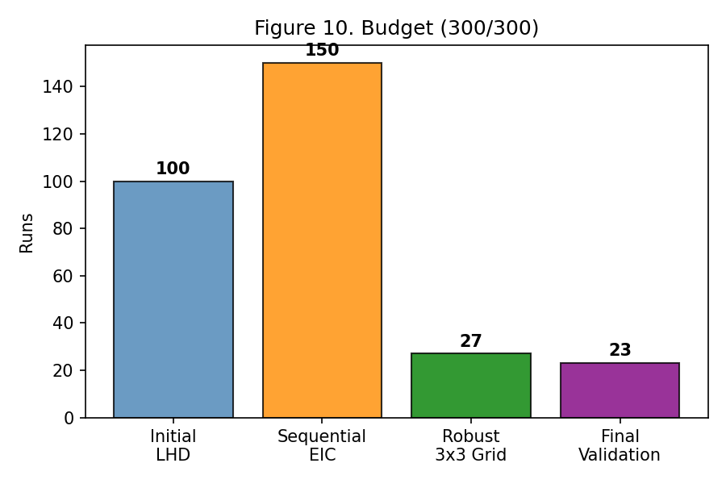{#fig-budget width=50%}

## Computational Infrastructure

Each FEM simulation takes ~80 seconds, making sequential execution of 300 runs prohibitively slow (~6.7 hours). To accelerate data generation, we built a three-stage SLURM pipeline on the Duke Computing Cluster:

1. **Input generation**: A MATLAB script produces the design matrix (LHD or EIC candidates) and writes it to a shared CSV file (`inputs/params.csv`).
2. **Parallel simulation**: A SLURM array job (`--array=1-N%40`) dispatches up to 40 concurrent tasks, each reading one row from the CSV, calling the FEM simulator, and writing its result to an individual output file.
3. **Result collection**: A final SLURM job (chained via `--dependency=afterok`) merges all individual outputs into a single summary CSV.

The pipeline is orchestrated by a single shell script (`submit_all.sh`) that chains the three stages via SLURM job dependencies. With 40-way parallelism, a batch of 100 simulations completes in ~4 minutes wall-clock time (vs. ~2.2 hours sequential), a ~33$\times$ speedup. This infrastructure enabled rapid iteration through the sequential optimization loop.

## Strengths and Limitations

Strengths: (1) maximin LHD provides excellent initial coverage; (2) GP validated via 10-fold CV with honest re-fitting; (3) EIC balances exploitation and exploration while respecting constraints; (4) $3 \times 3$ factorial grid systematically tests all extreme corners of operational uncertainty.

Limitations: (1) three variables hit their bounds, suggesting expanded ranges (especially CTE below $5 \times 10^{-6}$) could improve performance; (2) GP accuracy degrades in the boundary region where the optimum lies; (3) our robust optimization is two-stage (optimize then validate), which is simpler but less principled than a fully integrated robust EIC formulation.

# Conclusion

Through a four-phase framework — maximin LHD, GP surrogate modeling, sequential EIC, and staged robustness validation — we identified a turbine blade design that reduces maximum stress by 41%. The recommended design achieves 100% displacement feasibility under all tested operational perturbations ($3 \times 3$ grid + 20 random runs) with a 45% safety margin. CTE is the dominant design factor, and prioritizing low-CTE alloys is the single most impactful engineering action. All 300 simulator evaluations were utilized, with the GP (CV $R^2 > 0.994$) enabling efficient convergence in 150 sequential runs.



# Appendix {.unnumbered}

## A. Detailed Budget {.unnumbered}

| Phase | Runs | Cumul. | Description |
|:------|:-----|:-------|:------------|
| Initial LHD | 100 | 100 | Space-filling exploration |
| Seq. Batches 1–2 | 40 | 140 | First EIC batches |
| Seq. Batches 3–8 | 110 | 250 | Continued optimization |
| Robust $3 \times 3$ Grid | 27 | 277 | 3 candidates $\times$ 9 perturbations |
| Final Validation | 23 | 300 | 23 random perturbations |

## B. Input–Response Scatter Plots {.unnumbered}

@fig-scatter shows each of the six inputs plotted against stress (top row) and displacement (bottom row) for the 100 initial LHD runs. Infeasible designs (red) tend to concentrate at high CTE ($x_3$) and high pressure load ($x_6$) values, consistent with the sensitivity analysis discussed in the main text.

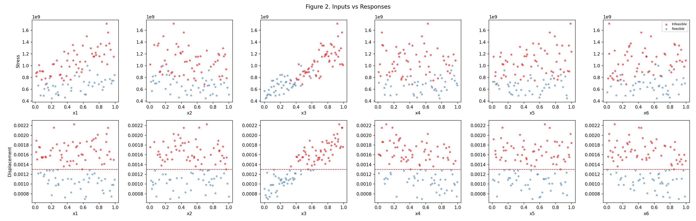{#fig-scatter width=85%}

## C. Software {.unnumbered}

- **Simulator**: MATLAB R2022b FEM solver (`simulator.p`)
- **Analysis**: Python 3.9 (NumPy, SciPy, scikit-learn, Matplotlib, Pandas)
- **GP**: `sklearn.gaussian_process.GaussianProcessRegressor` with Matérn-5/2 + ARD
- **Compute**: Duke Computing Cluster (SLURM, up to 40-way parallel); ~80 sec/simulation
